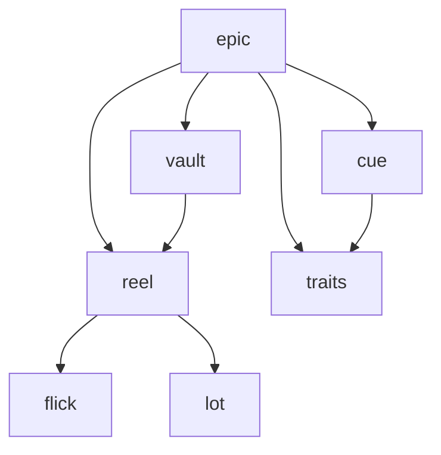

# Architecture

Backlot is a Rust monorepo for AI agent orchestration. It solves the problem of
running LLM-powered agents that can read, write, and execute code — safely — and
coordinating them to solve large, multi-step problems through recursive
decomposition. The stack is layered: low-level LLM calls and process sandboxing
at the bottom, an agent runtime with tools in the middle, a knowledge store, and
a recursive task orchestrator at the top.

The codebase is ~30k lines across seven crates, each with a library and (except
epic and cue) a thin CLI binary. All crates follow the same pattern: the library owns
all logic; the CLI parses config, calls the library, and formats output.

## Crate Dependency Graph

**flick** and **lot** are leaf crates with no internal dependencies. **traits**
is a leaf crate containing shared trait definitions (`EventEmitter<E>`). **cue**
is a near-leaf crate defining the generic orchestration framework (types,
coordination algorithm) depending only on traits. **reel** combines flick and lot
into an agent runtime. **vault** layers a knowledge store on top of reel.
**epic** implements cue's traits with AI agent calls via reel and vault, and
provides the `EventLog` that implements `EventEmitter<CueEvent>`.

## Code Map

Organized by dependency order (leaves first, consumers last). Each section names
the key modules and types a contributor needs to navigate the crate.

### flick — LLM provider abstraction

Single-shot LLM primitive. Takes a request config and query, calls one model,
returns a JSON result. Declares tools but never executes them — the caller
drives the tool loop.

| Module | Purpose |
|--------|---------|
| `lib.rs` | Public API re-exports |
| `provider/messages.rs` | Anthropic Messages API implementation |
| `provider/chat_completions.rs` | OpenAI-compatible Chat Completions implementation |
| `provider/http.rs` | Shared HTTP client, retry, error mapping |
| `model_registry.rs` | `ModelRegistry` — named model resolution from `~/.flick/models` TOML |
| `provider_registry.rs` | `ProviderRegistry` — named provider resolution from `~/.flick/providers` TOML |
| `config.rs` | `RequestConfig` — per-invocation parameters (model, system prompt, tools, schema) |
| `runner.rs` | `run()` — single model call, returns `FlickResult` |
| `context.rs` | `Context` — conversation history for multi-turn resume |
| `crypto.rs` | API key encryption/decryption |
| `structured_output.rs` | Two-step structured output for Chat Completions (tools + output_schema) |
| `validation.rs` | Cross-registry validation (model references valid provider, etc.) |

**Resolution chain:** `RequestConfig.model` name &rarr; `ModelRegistry` lookup &rarr;
`ModelInfo.provider` &rarr; `ProviderRegistry` lookup &rarr; `ProviderInfo` with
API type, URL, credential. Resolution happens once at `FlickClient::new()` — errors
fail at construction, not at call time.

**Provider abstraction:** `DynProvider` is the object-safe wrapper. Provider
quirks are handled by `CompatFlags` (boolean fields), not subclassing.

See [docs/FLICK_DESIGN.md](docs/FLICK_DESIGN.md) for data flow
diagrams and library/CLI boundary rules.

---

### lot — Cross-platform process sandboxing

Launches child processes with restricted filesystem and network access. Three
platform backends, one API surface.

| Module | Purpose |
|--------|---------|
| `lib.rs` | Public API: `spawn()`, `probe()`, types |
| `policy.rs` | `SandboxPolicy` — validated set of path grants/denies + network flag |
| `policy_builder.rs` | `SandboxPolicyBuilder` — builder with auto-canonicalization and platform defaults |
| `command.rs` | `SandboxCommand` — command + args + env + stdio config |
| `error.rs` | `SandboxError` — typed errors (Setup, Cleanup, PrerequisitesNotMet) |
| `unix.rs` | `UnixSandboxedChild` — shared lifecycle (wait, kill, stdio) for Linux and macOS |
| `linux/mod.rs` | `LinuxSandbox` — user namespaces + mount namespaces + seccomp-BPF |
| `linux/namespace.rs` | Mount sequence (7 steps), pivot_root, uid/gid mapping |
| `linux/seccomp.rs` | BPF filter construction (syscall allowlist, conditional rules) |
| `macos/mod.rs` | `MacSandbox` — fork + seatbelt |
| `macos/seatbelt.rs` | SBPL profile generation from policy |
| `windows/mod.rs` | `WindowsSandbox` — AppContainer + Job Objects |
| `windows/appcontainer.rs` | Profile lifecycle, ACL management, process creation |
| `windows/traverse_acl.rs` | Ancestor directory traverse ACE grants for AppContainer |
| `windows/sentinel.rs` | Sentinel file ACL recovery from crashed sessions |
| `windows/prerequisites.rs` | One-time NUL device + traverse ACE setup |

**Platform mechanisms:**
- **Linux:** User namespaces (unprivileged) + mount namespace (private root with
  only allowed paths) + PID/net/IPC namespaces + seccomp-BPF syscall filtering.
- **macOS:** Seatbelt (`sandbox_init`) with generated SBPL profiles. Single fork,
  `setsid()` for process group cleanup.
- **Windows:** AppContainer kernel boundary + Job Objects for RAII cleanup. ACL
  entries grant the package SID access to specific paths.

**No graceful degradation.** If a platform mechanism is unavailable, `spawn()`
returns `SandboxError::Setup`. No silent fallback to unsandboxed execution.

See [docs/LOT_DESIGN.md](docs/LOT_DESIGN.md) for full platform mechanism
details, deny path semantics, and Windows-specific concerns.

---

### reel — Agent session runtime

Owns the tool loop: spawns a sandboxed NuShell process, offers 6 built-in tools
to the LLM, and runs request-dispatch-response cycles until the model returns a
final answer.

| Module | Purpose |
|--------|---------|
| `lib.rs` | Public API re-exports |
| `agent.rs` | `Agent`, `AgentEnvironment`, `AgentRequestConfig`, `RunResult`, `ToolHandler` trait, tool loop |
| `nu_session.rs` | `NuSession` — persistent `nu --mcp` process, JSON-RPC 2.0 stdio, sandbox lifecycle |
| `tools.rs` | `ToolGrant` bitflags, tool definitions, nu command translation, `execute_tool` dispatch |
| `sandbox.rs` | Re-exports of lot prerequisite APIs (so consumers avoid direct lot dependency) |

**Agent runtime (`Agent`):** Dispatch heuristic routes based on tool
availability — tools present triggers `run_with_tools` (tool loop, up to 50
rounds / 200 tool calls); no tools triggers `run_structured` (single flick
call). Custom tools via `ToolHandler` trait dispatch before built-ins (allows
override).

**NuShell session (`NuSession`):** Persistent `nu --mcp` child process inside a
lot sandbox. Communication is JSON-RPC 2.0 over stdio. Sandbox policy derived
from `ToolGrant` flags — grant changes trigger process kill and respawn.

**Six built-in tools:** Read, Write, Edit, Glob, Grep, NuShell. Each translates
to a nu custom command (`reel read`, `reel write`, etc.) defined in
`reel_config.nu`. Write and Edit require the `WRITE` grant. All output truncated
at 64 KiB.

**`ToolGrant` bitflags:** `TOOLS` (read-only file tools + NuShell), `WRITE`
(adds Write/Edit, implies TOOLS), `NETWORK` (allows network in sandbox, implies
TOOLS). Fine-grained `write_paths` on `AgentRequestConfig` allow scoped write
access without full `WRITE`.

**Build system (`build.rs`):** Downloads NuShell 0.111.0 + ripgrep 14.1.1 at
compile time with SHA-256 verification. Generates nu config files. Emits
`NU_CACHE_DIR` for runtime path resolution.

See [docs/REEL_DESIGN.md](docs/REEL_DESIGN.md) for nu session internals,
sandbox policy construction, and tool translation details.

---

### vault — File-based knowledge store

Persistent document store backed by a reel agent (the "librarian"). Accumulates
project knowledge through four operations. Documents are markdown files in a
three-area directory structure.

| Module | Purpose |
|--------|---------|
| `lib.rs` | `Vault`, `VaultEnvironment`, `VaultModels`, public API |
| `storage.rs` | `Storage` — all file I/O, changelog, versioning, snapshots |
| `prompts.rs` | System prompt composition (shared blocks + per-operation) |
| `librarian.rs` | `DerivedProducer` and `QueryResponder` traits, `ReelLibrarian` impl |
| `bootstrap.rs` | Bootstrap operation — requirements &rarr; initial document set |
| `record.rs` | Record operation — new content &rarr; librarian integration |
| `query.rs` | Query operation — read-only question answering |
| `reorganize.rs` | Reorganize operation — full sweep: merge, split, deduplicate |

**Storage model:** `raw/` (immutable versioned inputs), `derived/` (librarian-managed
current-reality documents), `CHANGELOG.md` (append-only JSONL mutation log).
Derived documents can be reconstructed from raw + changelog if corrupted.

**Librarian:** A reel agent with `project_root` set to the storage root. Gets
`TOOLS` grant + `write_paths: [derived/]` — can read everything, write only to
derived. Two traits (`DerivedProducer`, `QueryResponder`) enable mock-based
testing without LLM calls.

See [docs/VAULT_DESIGN.md](docs/VAULT_DESIGN.md) for document model, operation
sequences, and the integration contract with epic.

---

### cue -- Generic recursive task orchestration framework

Defines the coordination algorithm and trait contracts for recursive task
decomposition with retry, escalation, fix loops, and recovery. Application crates
provide concrete `TaskNode` and `TaskStore` implementations. No AI, vault, reel,
flick, or lot dependencies.

| Module | Purpose |
|--------|---------|
| `lib.rs` | Public API re-exports |
| `types.rs` | All orchestration-protocol types: `TaskId`, `TaskPhase`, `TaskPath`, `Model`, `TaskOutcome`, `Attempt`, `Magnitude`, outcome/decision enums, context types (`SiblingSummary`, `ChildSummary`) |
| `traits.rs` | `TaskNode` (30 methods: accessors, decisions, mutations, lifecycle) and `TaskStore` (storage, creation, cross-task queries) |
| `orchestrator.rs` | `Orchestrator<S: TaskStore, T: EventEmitter<CueEvent>>` -- coordination loop: `run()`, `execute_task()`, `run_leaf()`, `execute_branch()`, `finalize_branch()`, `branch_fix_loop()`, `attempt_recovery()` |
| `context.rs` | `TreeContext` -- read-only snapshot of tree state around a task |
| `events.rs` | `CueEvent` enum (10 orchestration variants) |
| `config.rs` | `LimitsConfig` (depth, retry, fix rounds, recovery, task cap), `VerificationStep` |

**Trait design:** Two-trait split. `TaskNode` covers data access, decisions,
mutations, and async lifecycle methods. `TaskStore` covers task creation, storage,
lookup, cross-task queries, and tree context building. The orchestrator is generic
over `S: TaskStore` and `T: EventEmitter<CueEvent>` (from the `traits` crate).

**Decision collapsing:** The coordinator asks the task what to do rather than
inspecting internals. `resume_point()`, `forced_assessment()`,
`can_attempt_recovery()`, `needs_decomposition()`, `fix_round_budget_check()` are
collapsed decision methods that replace multi-field reads in the coordinator.

**Runtime injection:** Tasks receive runtime deps (agent, vault, event log) at
construction time via `TaskStore::create_subtask()`, not from the orchestrator.
After deserialization, `TaskStore::bind_runtime()` re-injects non-serializable deps.

---

### mech — Declarative workflow definition and cue integration

Provides a YAML-based workflow format for LLM-driven control and dataflow graphs.
Workflows are loaded once, validated, and executed by a runtime that bridges cue
orchestration with reel agent execution. See [docs/MECH_SPEC.md](docs/MECH_SPEC.md)
for the full specification.

| Module | Purpose |
|--------|---------|
| `lib.rs` | Public API re-exports |
| `loader/` | `load_workflow(path) → Workflow` — parse → validate → infer → compile CEL |
| `schema/mod.rs` | Serde types: `MechDocument`, `FunctionDef`, `BlockDef`, `AgentConfig`, etc. |
| `schema/registry.rs` | `SchemaRegistry` — compile and validate JSON Schemas, resolve `$ref` |
| `schema/infer.rs` | Output schema inference (`output: infer`) from terminal block schemas |
| `schema/mode.rs` | `InferMode` / `infer_mode` — classify a function as Imperative (CFG) or Dataflow from its block edges; consumed by `schema::infer` and `loader` |
| `validate/` | `validate_workflow` — 24+ load-time checks (§10.1 of spec) |
| `cel.rs` | CEL compilation (`CelExpression`) and template interpolation (`Template`) |
| `context.rs` | `ExecutionContext` (per-invocation), `WorkflowState` (workflow-lifetime) |
| `conversation.rs` | `Conversation` — per-function message history and compaction hook (placeholder); the system prompt is delivered separately via `AgentRequest.system` and is not stored on the conversation |
| `exec/prompt.rs` | `execute_prompt_block` — agent cascade, template render, LLM dispatch |
| `exec/call.rs` | `execute_call_block` — single/uniform/per-call forms, output mapping |
| `exec/schedule.rs` | `run_function_imperative` — transition evaluation, side-effects |
| `exec/dataflow.rs` | `run_function_dataflow` — topo-sort, level-sequential scheduling (within-level parallelism is future work) |
| `exec/function.rs` | `FunctionRunner` — per-invocation dispatch, mode detection, depth limit, system-prompt rendering call site |
| `exec/system.rs` | `render_function_system` — system-prompt template rendering (resolves function-level override over workflow-level default) |
| `exec/workflow.rs` | `WorkflowRuntime` — top-level entry point, workflow-state initialisation |
| `exec/agent.rs` | `AgentExecutor` trait, `AgentRequest`, `AgentResponse` — agent seam for testing |
| `cue_integration.rs` | `MechTask` (`cue::TaskNode`) and `MechStore` (`cue::TaskStore`) — bridges mech to cue orchestration |
| `error.rs` | `MechError` — all load-time and runtime error variants |

**`AgentExecutor` seam:** Mech never calls reel directly. The `AgentExecutor` trait
(`exec/agent.rs`) is the seam between prompt block execution and the agent runtime.
The production impl wraps reel; tests inject a deterministic fake. This keeps
all tests hermetic and fast — no network, no real models.

**Cue integration:** `MechTask` implements `cue::TaskNode` as a leaf-only task.
`forced_assessment` always returns `TaskPath::Leaf`. `execute_leaf` runs
`WorkflowRuntime` over the named function and maps `MechError` to `TaskOutcome`.
Escalation fires when the assessment-selected model differs from the workflow
default (i.e. `task.model != workflow_default`); when no workflow default is
declared (`workflow_default = None`, e.g. the workflow uses `agent: "$ref:#named_config"`)
escalation is disabled because there is no comparable model to diverge from.
When escalation fires, `execute_leaf` wraps the executor with `EscalatingExecutor`
to override the model at the workflow/function level while preserving block-level
agent configs. `MechStore` is a minimal `HashMap`-backed `TaskStore` for
leaf-only scenarios.

See [docs/MECH_SPEC.md](docs/MECH_SPEC.md) for the workflow format, §11 for the
cue integration design, and [docs/STATUS.md](docs/STATUS.md) for implementation
status.

**Test coverage:** The mech test suite covers validation (positive and negative
fixtures for most §10.1 checks), schema registry (cycle detection, alias
resolution, nested refs), loader pipeline edge cases, and runtime integration
tests. See module-level `#[cfg(test)]` blocks for specifics.

---

### epic -- Recursive problem-solver orchestrator

Top-level consumer. Implements cue's `TaskNode` and `TaskStore` traits with AI
agent calls, vault knowledge persistence, and a TUI. Decomposes a problem into a
task tree, delegates leaf tasks to AI agents, verifies results, and recovers from
failures through retry, escalation, and re-decomposition.

| Module | Purpose |
|--------|---------|
| `main.rs` | CLI entry point (init, run, resume, status, setup) |
| `cli.rs` | Argument parsing, output formatting |
| `store.rs` | `EpicStore<A>` — implements `cue::TaskStore`, wraps `EpicState` + runtime deps |
| `orchestrator/mod.rs` | Thin module re-exporting `context` and `tests` submodules |
| `orchestrator/context.rs` | `TreeContext` building, `TaskContext` assembly for agent calls |
| `task/mod.rs` | `Task` struct, `TaskRuntime<A>`, types, self-contained mutation methods |
| `task/node_impl.rs` | `EpicTask<A>` — implements `cue::TaskNode`, lifecycle methods |
| `task/leaf.rs` | Leaf execution helpers |
| `task/branch.rs` | Branch decision types and methods (verify, fix, recovery, checkpoint) |
| `task/scope.rs` | Scope circuit breaker — git diff magnitude check |
| `task/assess.rs` | `AssessmentResult` — path (leaf/branch) + model selection |
| `task/verify.rs` | `VerificationOutcome`, configurable verification steps |
| `agent/reel_adapter.rs` | `ReelAgent` — adapts reel's `Agent` to epic's `AgentService` trait |
| `agent/prompts.rs` | Per-phase prompt assembly |
| `agent/wire.rs` | Wire format types for structured agent output |
| `knowledge.rs` | `ResearchQuery` tool (vault gap-filling pipeline), vault integration |
| `state.rs` | `EpicState` — task tree and session state, JSON persistence |
| `events.rs` | `Event` enum (25 variants), `EventLog` (append-only), `EventSubscription`, `From<CueEvent>` adapter |
| `config/mod.rs` | `EpicConfig`, model config, vault config |
| `config/project.rs` | `ProjectConfig` — verification steps from `epic.toml` |
| `init.rs` | Interactive project setup (detect build system, generate config) |
| `sandbox.rs` | Container/VM detection, lot prerequisite checks |
| `tui/mod.rs` | Terminal UI (ratatui + crossterm): task tree, worklog, metrics |

**Task lifecycle:** Pending &rarr; Assessing &rarr; Executing &rarr; Verifying
&rarr; Completed | Failed. Assessment (Haiku) decides leaf vs branch path and
which model executes. Root task is always branch. Max-depth tasks are always
leaf.

**Coordinator/task split:** The orchestrator is a pure coordinator. Tasks own
their behavior — leaf tasks run their full lifecycle internally
(`Task::execute_leaf`); branch tasks expose decision methods that return
structured enums, and the orchestrator acts on those decisions.

**Three-layer agent abstraction:**

| Layer | Crate | Scope |
|-------|-------|-------|
| Conversation turn | flick | One model call, one reply. No tools. |
| Agent session | reel | Tool loop until final response. Side effects via tools. |
| Orchestration | epic | Multi-task tree. Retry, escalation, recovery, persistence. |

Epic never calls flick directly — all agent work routes through reel.

**Recovery ordering** (cheapest to most expensive): scope circuit breaker &rarr;
retry budget exhaustion / model escalation (Haiku &rarr; Sonnet &rarr; Opus)
&rarr; terminal leaf failure / rollback &rarr; parent Opus recovery assessment
&rarr; branch failure / escalate to grandparent &rarr; global task count cap.

See [docs/EPIC_DESIGN.md](docs/EPIC_DESIGN.md) for task model, context
propagation, verification/fix loops, document store integration, and TUI design.

## Entry Points

Key types and functions to start navigating the codebase. Names are greppable.

| What | Symbol | Location |
|------|--------|----------|
| LLM call | `FlickClient::new()`, `runner::run()` | `flick/flick/src/` |
| Spawn sandboxed process | `lot::spawn()` | `lot/lot/src/lib.rs` |
| Sandbox policy construction | `SandboxPolicyBuilder` | `lot/lot/src/policy_builder.rs` |
| Agent session entry | `Agent::run()` | `reel/reel/src/agent.rs` |
| Tool loop | `run_with_tools()` | `reel/reel/src/agent.rs` |
| NuShell process management | `NuSession::spawn()`, `NuSession::evaluate()` | `reel/reel/src/nu_session.rs` |
| Tool dispatch | `execute_tool()` | `reel/reel/src/tools.rs` |
| Vault operations | `Vault::bootstrap()`, `Vault::record()`, `Vault::query()`, `Vault::reorganize()` | `vault/vault/src/lib.rs` |
| Generic orchestration | `cue::Orchestrator::run()` | `cue/src/orchestrator.rs` |
| TaskNode trait | `cue::TaskNode` (30 methods) | `cue/src/traits.rs` |
| TaskStore trait | `cue::TaskStore` | `cue/src/traits.rs` |
| Epic store (TaskStore impl) | `EpicStore::from_state()` | `epic/src/store.rs` |
| Epic task (TaskNode impl) | `EpicTask<A>` | `epic/src/task/node_impl.rs` |
| Leaf lifecycle | `EpicTask::execute_leaf_impl()` | `epic/src/task/node_impl.rs` |
| Branch decisions | `EpicTask::verify_branch()`, `EpicTask::design_fix()` | `epic/src/task/node_impl.rs` |
| Research pipeline | `ResearchQuery` (ToolHandler impl) | `epic/src/knowledge.rs` |
| State persistence | `EpicState::save()`, `EpicState::load()` | `epic/src/state.rs` |
| Workflow load | `load_workflow()` | `mech/src/loader/mod.rs` |
| Run mech workflow | `WorkflowRuntime::run()` | `mech/src/exec/workflow.rs` |
| Mech cue integration | `MechTask`, `MechStore` | `mech/src/cue_integration.rs` |

## Architecture Invariants

These constraints are enforced by convention, not by the compiler.

1. **Library crates never start a runtime, write to stdout, or call
   `process::exit`.** All async methods assume the caller provides a tokio
   runtime. All output is via return values. Errors are returned, not fatal.
   CLI crates own the runtime and I/O.

2. **No globals, statics, or singletons.** All major components receive
   dependencies explicitly via constructor arguments or method parameters.
   `TaskRuntime<A>`, `AgentEnvironment`, `VaultEnvironment` are the dependency
   bundles.

3. **Epic never calls flick directly.** All agent work routes through reel.
   Flick is a leaf dependency of reel, not of epic.

4. **Sandbox enforcement is the sole access control mechanism.** `ToolGrant`
   flags control which tool *definitions* are offered to the model (prevents
   wasting tokens on calls that would fail). Lot's OS-level sandbox is what
   actually enforces filesystem and network boundaries.

5. **No graceful degradation in sandboxing.** If a platform sandbox mechanism is
   unavailable, `spawn()` returns an error. There is no fallback to unsandboxed
   execution.

6. **Vault's derived documents represent current reality, not history.** When
   information becomes obsolete, it is removed. `CHANGELOG.md` and `raw/`
   preserve the historical record.

7. **Tests never silently skip.** Missing prerequisites cause a panic, not a
   quiet early return. A skipped test is treated as a lie.

8. **Sandbox temp directories must not use system temp on Windows.** Crates
   using lot for sandboxing place temp paths under the project root to avoid
   requiring elevated ACE grants on `C:\Users` ancestor directories.

## Cross-Cutting Concerns

### Error Handling

Each crate defines its own error type (`SandboxError`, `FlickError`, etc.).
Errors are returned, never caught-and-swallowed. No `catch(...)` or broad
exception handlers. Vault operations called from epic are best-effort — failures
are logged but never abort the orchestrator run.

### Testing Strategy

All crates use the same pattern:
- **Unit tests** for policy validation, serialization, parsing.
- **Integration tests** for real OS mechanisms (sandbox, nu process, agent loop).
- **Trait-based mocking** for expensive dependencies: `ClientFactory` and
  `ToolExecutor` in reel, `DerivedProducer` and `QueryResponder` in vault,
  `AgentService` in epic.
- **CI matrix:** Linux + macOS + Windows for clippy, build, and test.

### Sandboxing as Infrastructure

Lot provides the sandbox primitive. Reel owns the sandbox *policy* (derived from
`ToolGrant` flags and `write_paths`). Epic controls which grants each agent
phase receives. This separation means:
- Lot knows nothing about tools or agents.
- Reel knows nothing about tasks or orchestration.
- Epic specifies intent (read-only vs writable); reel translates to policy; lot
  enforces at the OS level.

### Prompt Caching

Flick handles `cache_control` breakpoint injection automatically. Multi-turn
sessions in reel and epic benefit from cached system prompts and tool
definitions with no consumer-side code.

### Observability

Reel returns `RunResult` with `Usage` (tokens + cost), `TurnRecord` transcript,
and per-call API latency. Vault wraps this as `SessionMetadata`. Epic
accumulates usage per task and surfaces it through events and TUI metrics.

### Configuration

Flick: `~/.flick/providers` and `~/.flick/models` (TOML, encrypted keys).
Reel: YAML config passed to CLI or `AgentRequestConfig` in library.
Vault: `VaultModels` struct with per-operation model names.
Epic: `epic.toml` or `.epic/config.toml` with verification steps, model
preferences, vault config. Resolution: project config overrides user-level
defaults at `~/.config/epic/config.toml`.

## Per-Crate Documentation

For implementation details beyond this architectural overview:

| Crate | Document |
|-------|----------|
| flick | [docs/FLICK_DESIGN.md](docs/FLICK_DESIGN.md) |
| lot | [docs/LOT_DESIGN.md](docs/LOT_DESIGN.md) |
| reel | [docs/REEL_DESIGN.md](docs/REEL_DESIGN.md) |
| vault | [docs/VAULT_DESIGN.md](docs/VAULT_DESIGN.md) |
| cue | [docs/CUE_DESIGN.md](docs/CUE_DESIGN.md) |
| epic | [docs/EPIC_DESIGN.md](docs/EPIC_DESIGN.md) |
